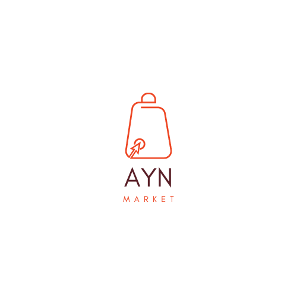

  <h1>AYN Market</h1>
  
AYN market is an e-commerce website application that allows users to buy and sell various products online. AYN stands for All You Need, which reflects the vision of the project to provide a convenient and user-friendly platform for online shopping.

## Overview

AYN market is a full stack  modern and responsive e-commerce website application that aims to provide a seamless and enjoyable online shopping experience for both buyers and sellers. It  has a secure and scalable architecture that can handle high traffic and data volume. AYN market is the ultimate solution for all your online shopping needs. It's A final graduation project in which we get in it excellent grade.

## Usage

To use the website application, you need to have Docker installed on your machine. Then, follow these steps:

1. Clone this repository to your local machine.
2. Navigate to the root directory of the project and run `docker-compose up --build` to build and run the containers.
3. Open your browser and go to `http://localhost:3000` to access the website.
4. You can register as a new user or log in with an existing account.
5. You can browse, search, and filter products by categories, prices.
6. You can add products to your cart and proceed to checkout.
7. You can view and manage your orders, purchases, and profile settings.
8. To create admin user you can use this command `docker-compose run --rm backend sh -c " python manage.py createsuperuser" `.

## Technologies

The website application is built with the following technologies:

## Future Work

The project is still under development and we have plans to improve and enhance the website application in the following aspects:

- **Dashboard for admin panel**: provide statistics and insights on the website performance and user behavior.
- **Admin user management**: We will enable the admin to create, view, and delete other admin users. The admin will also be able to assign different roles and permissions to other admins, such as super admin, moderator.
- **Payment methods**: We will add more payment methods for customers, such as credit card for now there is only paypal method.
- **Address management**: We will allow customers to add, edit, and delete their addresses.
- **Recommendation system**: We will try to build a recommendation system for customers that will help them discover and purchase products that match their preferences and needs.
- **Coupons and discounts**: We will add coupons and discounts for sales and promotions. We will also notify customers of any discounted products in the market via push notifications.
- **Responsive design**: We will work on improving the responsive design of the user interface to make it compatible and adaptable to different devices and screen sizes.

We hope to achieve these goals in the near future and deliver a better and more satisfying online shopping experience for our users.
  

## Team
- Rabeh Rabiee: Backend developer 
- Zakaria Loai: Frontend developer 

